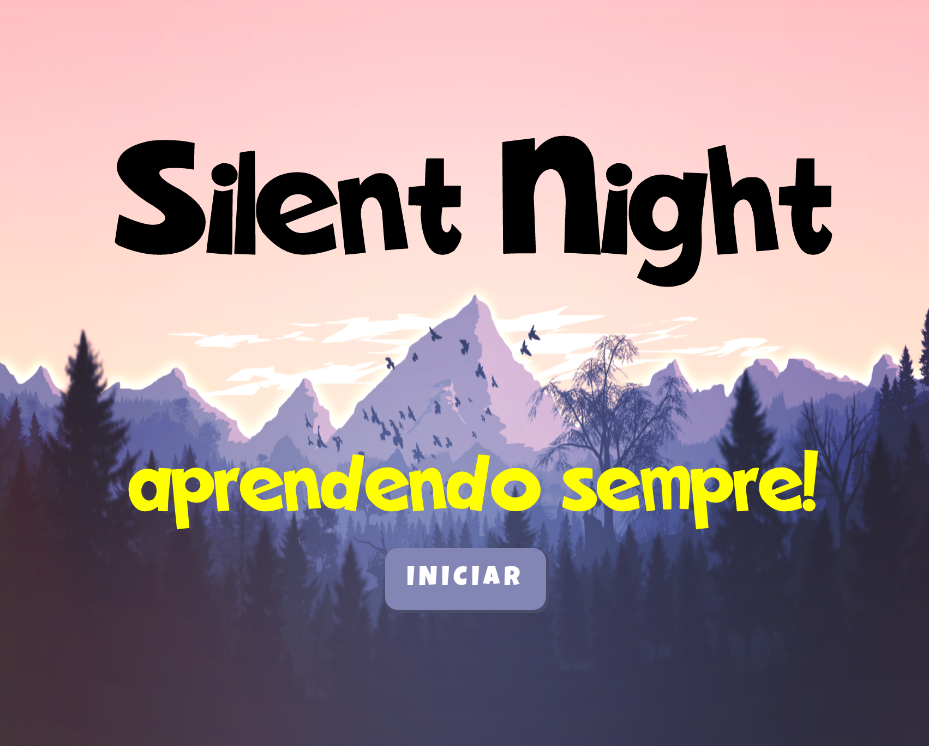

# silent-night

Game Educativo #imersaogamedev

## Resumo

Após a https://github.com/imersao-gamedev eu adaptei o jogo do curso para um jogo educativo com perguntas e respostas.

As perguntas e outras configurações estão no arquivo fita.json .

## Release 2 (aceito PRs!)

* Mais fases com outras perguntas
* Power-ups
* Página de créditos
* Efeito Paralax
* Mais efeitos sonoros

## Screenshot



## Créditos

* Curso de [Imersão Gamedev da Alura](https://www.alura.com.br/imersao-gamedev-javascript)
* Música do Jogo - [Sash! - Ecuador](https://youtu.be/9cQlVww0zKo)
* Música do Game Over - [Knightmare Gold](https://www.amusementfactory.com.br/msx/kmg/?p=3&l=br)
* Efeitos extras - [Sonic](https://www.101soundboards.com/boards/10990-sonic-the-hedgehog-sounds)


## Jogue online

[jogue em tela cheia](https://editor.p5js.org/boaglio/full/qndtI9nTY)

## Jogue localmente

Edite o arquivo [docker-compose.yaml](docker-compose.yaml) , depois suba a aplicação:

```
docker compose up
```

Em seguida acesse: 

http://localhost:8000
